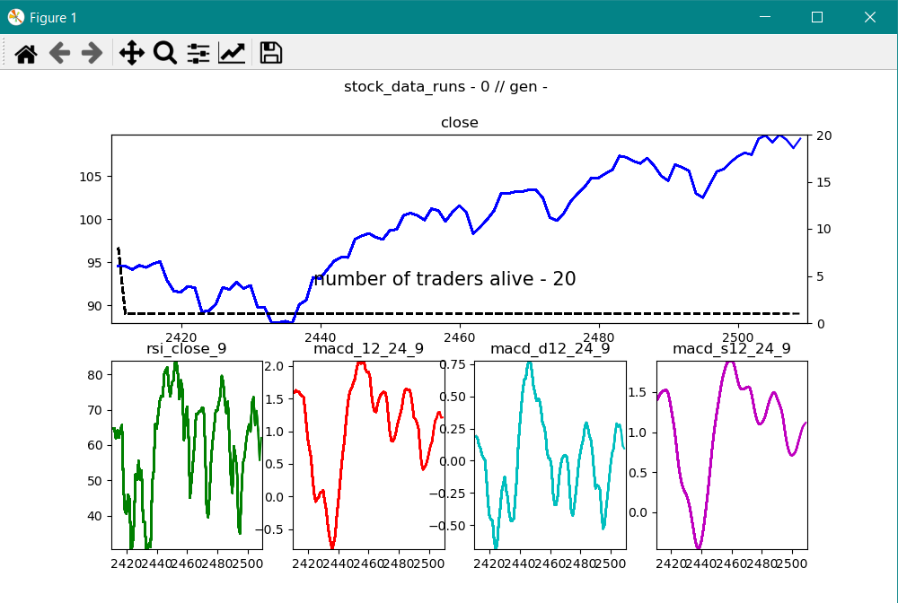

<!-- PROJECT LOGO -->
 

  

  <h1 align="center">Trading competition</h1>

**IMPORTANT DISCLOSURE: This is project was done primarly for research  prupuses, not actual financial advice. Not use it on your own financial decisions.**

## About The Project:
Setting a "Trading competition" in which we set up a bunch of "traders", gave them real word data and some variables (tecnical indicators) and let them learn by running on the data. The trader with the greathest profit wins !!!

Its normal in the banking trading word to set a competion on which expetionally tallented traders try to beat each other by achieving the greatest amount of profit. The premise its quite simple: by buying and selling financial assets, using their own knowledge, expertiese and a limited amount of resources in a controlled "real word" situation, they must achive the greatest return or the lowest loss in a time given. The competitors tent to have years of proffesional knowledge, and most of them already work in a heavily focus finance enviroment: hedge funds, private practive, finance research and investigation, etc, but what if we are able to set a competition of "junior" traders, test how well they go with out mayor initial insights, select the best one of them, and proceed to continue its edecution to hence its inheit capabilities? We can make this with AI?

Using a NEAT algorithm (Neuroevolution of augmenting topologies) we create a set of 'traders'. They starts with a limited money budget, and by buying, selling or holdings stocks they need to achieve the greatest available result. We gave them real word financial data: stock prices, tecnical indicators (MACD , RSI, etc) and let them run to interpeter the best way to use them. At the end of each run, a period of time-data in which we set and close the competition (example 5 years of data), we cut the worst performing traders and reproduce the best ones. This generational operation will cultivate the best cualities and behaviours of the most succesfull traders, allowing us to reproduce them without on similar new situation on where they were train.

 

  <h3 align="center">Example visualization</h3>
  

The training data user were free stock prices from [https://www.alphavantage.co/](https://www.alphavantage.co/) split on downwarding/upwarding long trends and low/high volativities periods, as the trained trader will act better by this differentiating circumstances.

On this project we were intended to only represent the training process, not an actual PROD level code that enables us to use a pretrained model.

## Getting Started
There are 2 main options for executing this repo:

### -- Using Docker

You will need to have Docker installed.
Just proceed to clone this repository, and execute con terminal `docker run training-competition`

### -- Creating env

1. Clone this repository into a new folder
2. Using any Virtual Enviroment manager (in my case I used anaconda) create a env with the dependencies appoinyed on the requirement.txt
3. Activate your enviroment, go the projects folder and execute: `python /src/main.py`

## Acknowledgments

This project was created and motivate on the amazing job of the following contributors:

* [Tech With Jim - AI Teaches Itself to Play Flappy Bird - Using NEAT Python!](https://www.youtube.com/watch?v=OGHA-elMrxI)
* [Computer Science - Algorithmic Trading Strategy Using MACD & Python](https://www.youtube.com/watch?v=kz_NJERCgm8&t=689s)
* [Alpha Vantage: Free Stock APIs in JSON & Excel](https://www.alphavantage.co/)
